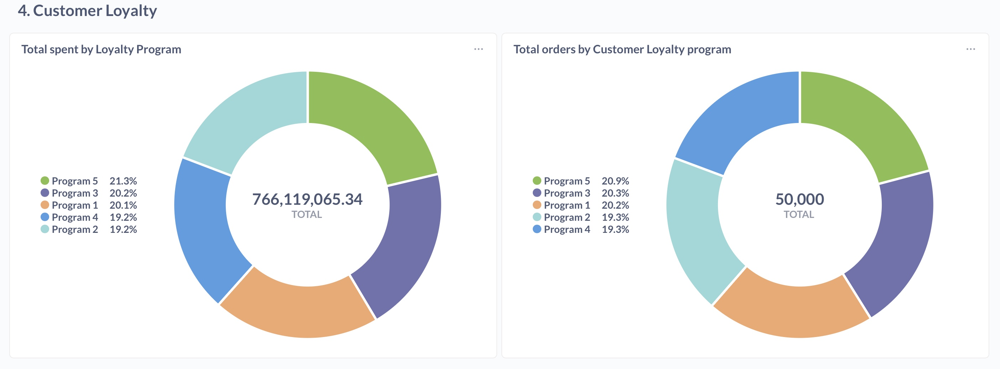

# 🛒 Retail Analytics Pipeline

This project implements an **end-to-end ELT pipeline** for retail data.  
It covers ingestion, transformation, data quality checks, orchestration, and visualization using **Airflow, dbt, PostgreSQL, MySQL, and Metabase**.

---

## 📑 Project Overview
- **Source database**: MySQL (raw data)  
- **Data warehouse**: PostgreSQL (analytics-ready)  
- **Pipeline orchestration**: Apache Airflow (via Docker)  
- **Transformations**: dbt (Silver & Golden layer models)  
- **Visualization**: Metabase (dashboards and KPIs)  

The pipeline supports **Slowly Changing Dimensions (SCD)**, data quality checks, and is containerized for reproducibility.

---

## ⚙️ Setup Instructions

### 1. Clone the Repository
```bash
git clone https://github.com/<your-username>/retail_pipeline_project.git
cd retail_pipeline_project
```

### 2. Environment Variables
Copy the example file and adjust values:
```bash
cp .env.example .env
```

Edit `.env` for your credentials, ports, and Metabase config.

### 3. Start Services with Docker
```bash
docker compose up -d
```

This will start:
- `retail-mysql` → Source database  
- `retail-postgres` → Data warehouse  
- `retail-dbt` → dbt transformations  
- `airflow-webserver`, `airflow-scheduler` → Orchestration  
- `retail-metabase` → Visualization (http://localhost:3000)

---

## 🗄️ Database Setup

### 1. Create Schema in PostgreSQL
Use provided DDL to initialize tables:
```sql
-- Example
CREATE TABLE customers (
    customer_id INT PRIMARY KEY,
    name VARCHAR(100),
    email VARCHAR(100),
    phone VARCHAR(20),
    loyalty_program_id INT,
    gender VARCHAR(10),
    age INT,
    created_at DATE
);
```

Full schema is in `DDL.docx`.

### 2. Load Raw Data into MySQL
Data is included in `retail_data.zip` and loaded into MySQL via the Airflow DAG task:
```python
load_raw_data = DockerOperator(
    task_id='load_csv_to_mysql',
    image='retail_pipeline_project-elt:latest',
    command='python load_data.py',
    auto_remove=True
)
```

---

## 📊 Pipeline Flow

### Raw Zone
- Ingest CSVs → MySQL → PostgreSQL staging (`stg_` tables).  

### Silver Zone
- Data cleaning, validation, data quality rules applied.  

### Golden Zone
- Business-ready tables and aggregated KPIs for dashboards.  

---

## 🚀 How to Run the Pipeline

### 1. Trigger Airflow DAG
```bash
docker exec -it <airflow-webserver-container> airflow dags trigger retail_elt_pipeline
```

### 2. Run dbt Models
```bash
docker exec -it retail-dbt dbt run
```

### 3. Test dbt Models
```bash
docker exec -it retail-dbt dbt test
```

### 4. Access Airflow UI
Open [http://localhost:8080](http://localhost:8080)

### 5. Access Metabase
Open [http://localhost:3000](http://localhost:3000)

---

## 📊 Dashboards

Here are the final dashboards created in Metabase to visualize key insights:

### Business KPIs Overview


### Inventory Alerts


### Sales Trends & Product Performance
  


### Category Performance & Returns


### Customer Loyalty


### Inventory Drilldown


---

## 💾 Backup & Restore Metabase

### Backup
```bash
docker exec -i retail-postgres \
  pg_dump -U postgres -d metabase_app > backups/metabase_app_$(date +%F).sql
```

### Restore
```bash
cat backups/metabase_app_YYYY-MM-DD.sql | \
  docker exec -i retail-postgres psql -U postgres -d metabase_app
```

---

## 📌 Notes
- Replace `<your-username>` in clone commands with your GitHub username.  
- Dashboards are included as screenshots for portability.  
- To expose dashboards online, configure Metabase with a reverse proxy (Caddy/Nginx).  

---
